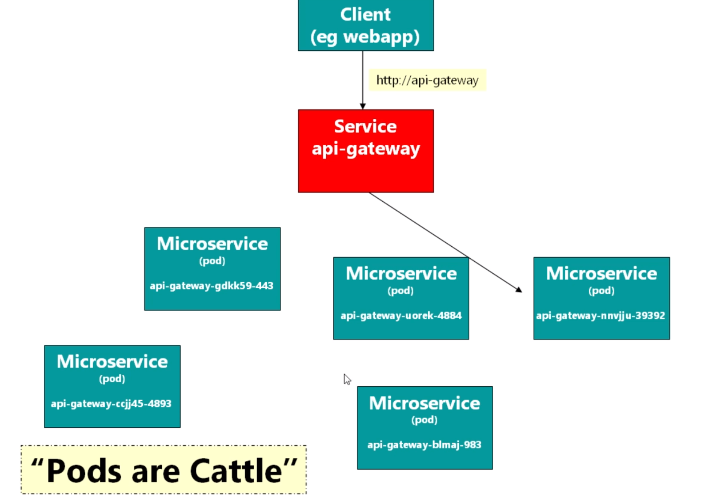

# Kubernetes

## Service & Pod

## Deployments

## Rollout

## Network

## Namespace

`nslookup domain_name`

## Logging

## Monitoring

- Prometheus
- Grafana

## Alert

- Prometheus Alerts
- AlertManager
- Integrate with Slack
- Integrate with PagerDuty

## What if the mast node done?
no impact on running workloads, but pods cannot be scheduled before master node recover, kubectl cannot be used as well

## Requests and Limits
- Requests: hint for master node when schedule a pod about how much resources the pod can run comfortablely , no impact on runtime resource utilization, just hint
- Limits: runtime impact on resource utitlization
  - cpu: how many cpu resource can be used
  - memory: upper limits of the memory usage, container will be killed once reach this limit

## Metrics profiling
- minikube addons: 
	- metrics-server
	  - `kubectl top pod`
      - `kubectl top node`
      - `kubectl describe node mimikube`
    - heapster (deprecated)
	- dashboard
- set resonable Requests as per the metrics

## Horizontal Pod AutoScale

`kubectl get hpa`
`kubectl get hpa api-gateway -o yaml`

## Readiness and Liveness probe

## Quality of Service and Eviction

- Pod priority

## ConfigMap and Secret

- configmap change will not hot reload for the relevant deployments which is using it, need to restart them
  - one option is using [reloader](https://github.com/stakater/Reloader/)
  - for spring, an option is spring cloud kubenetes or spring cloud config

use config map as
- env
  - single env value ref to config map
  - env section from config map
- mounted file
versioning the config to update the references to make it work

## Ingress controller

- Authentication

## Other workloads

- Batch Jobs
- Cron Jobs
- DaemonSets
  fluentd, logstash
- StatefulSets
  
  key point of "stateful" means the name of the pod is stateful, usage example: elasticsearch cluster, kafka cluster, database replication

## CI/CD

For jenkins, the key files are:
- DockerFiler
- JenkisFile
- deploy.yaml # which includes all the related components to this micro-service need to be deployed 

## Helm

Cmd for ad-hoc changes(bad smell, introduce snowflake cluster):
- helm install
- helm uninstall
- helm list
- helm show values
- helm upgrade

Cmd for get fixed version of Charts:
- helm pull
- helm install xxx [localpath]
- helm upgrade xxx [localpath] --values=customvalues.yaml

Cmd to use dynamic yaml(replace var in the yaml with values.yaml):
- help template

Create self custom Charts:
- helm create
- helm template
- template, values, go lang, {{ ... }}
- SubTemplate

# Common cmd

`kubectl get all`
(Section 5): list all objects that you’ve created. Pods at first, later, ReplicaSets, Deployments and Services
`kubectl apply –f <yaml file>`
(Section 5): either creates or updates resources depending on the contents of the yaml file
`kubectl apply –f .`
(Section 7): apply all yaml files found in the current directory
`kubectl describe pod <name of pod>`
(Section 5): gives full information about the specified pod
`kubectl exec –it <pod name> <command>`
(Section 5): execute the specified command in the pod’s container. Doesn’t work well in Cygwin.
`kubectl get (pod | po | service | svc | rs | replicaset | deployment | deploy)`
(Section 6): get all pods or services. Later in the course, replicasets and deployments.
`kubectl get po --show-labels`
(Section 6): get all pods and their labels
`kubectl get po --show-labels -l {name}={value}`
(Section 6): get all pods matching the specified name:value pair
`kubectl delete po <pod name>`
(Section 8): delete the named pod. Can also delete svc, rs, deploy
`kubectl delete po --all`
(Section 8): delete all pods (also svc, rs, deploy)
`kubectl rollout status deploy <name of deployment>`
(Section 9): get the status of the named deployment
`kubectl rollout history deploy <name of deployment>`
(Section 9): get the previous versions of the deployment
`kubectl rollout undo deploy <name of deployment>`
(Section 9): go back one version in the deployment. Also optionally -- to-revision=<revision number>
We recommend this is used only in stressful emergency situations! Your YAML will now be out of date with the live deployment!